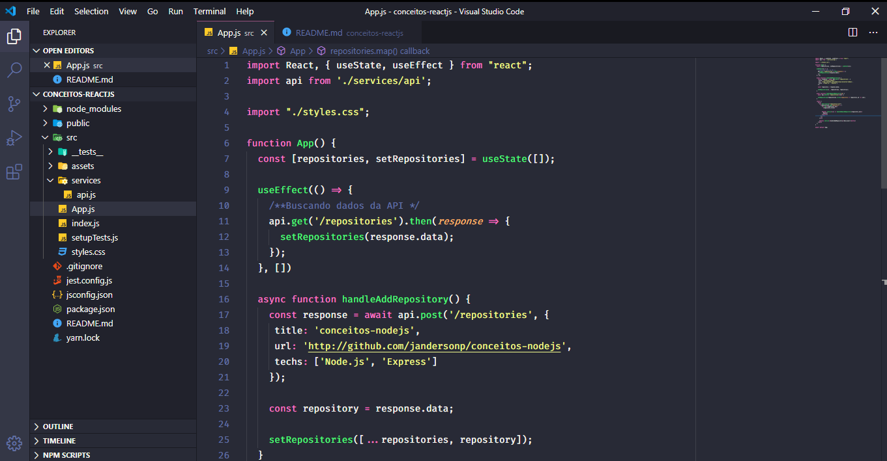

<h3 align="center">
  Desafio 03: Conceitos do ReactJS
</h3>

  <a href="#rocket-sobre-o-desafio">About the challenge</a>&nbsp;&nbsp;&nbsp;|&nbsp;&nbsp;&nbsp;

## :rocket: About the challenge

In this challenge, we created an application to store repositories in my portfolio. This application has the functionality to list, add, update and remove repositories.

We use the concepts of ReactJS as a basis to create our Frontend of the application

  

Made by Janderson Pizzially Vilas Boas (https://www.linkedin.com/in/jandersonvilasboas/)
